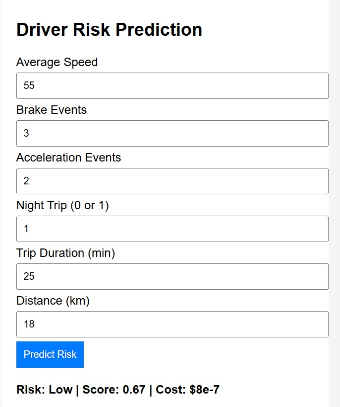
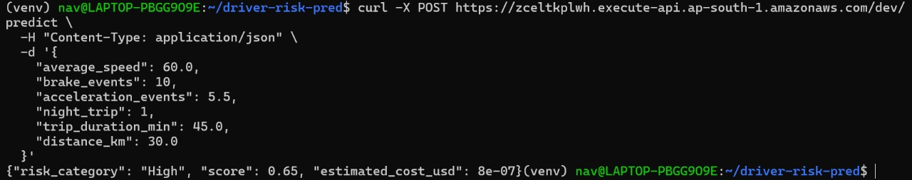

# Driver Risk Prediction - Serverless ML API

A lightweight serverless machine learning app that predicts driver risk level (Low / Medium / High) based on trip stats like Average Speed, Brake Events, Acceleration Events, Night Trip (0 or 1), Trip Duration (min), Distance (km). Powered by a trained scikit-learn model deployed on **AWS Lambda + API Gateway**, and a simple **HTML frontend** for quick testing.

---

## Overview

This project demonstrates how to build and deploy an ML model for real-time driver risk prediction using a serverless architecture.  
It includes model training, backend deployment via Docker + Lambda, and a basic UI for demo/testing.

---

## Features

-  Trained ML model (RandomForest Classifier)
-  FastAPI-based serverless backend (deployed to AWS Lambda)
-  API Gateway (HTTP API) with proper CORS handling
-  Docker-based container deployment
-  Simple frontend form (HTML + JS)
-  Zero server maintenance & cost-efficient

---

##  Tech Stack

- Python, Scikit-learn, Numpy
- FastAPI (inside Lambda function)
- AWS Lambda + API Gateway (HTTP API)
- Docker (for Lambda container packaging)
- HTML + JS (Frontend)
- GitHub (for version control & showcase)

---

##  Demo / Screenshots

###  UI Form (HTML)


###  API Response (cURL test)


---

##  How to Run Locally

### Train the model 

```bash
cd model_training
python train_model.py

```

### Backend Deploying (Lambda) 

```bash
cd backend
docker build -t driver-risk-lambda .
docker tag driver-risk-lambda:latest <your-ecr-repo-url>
docker push <your-ecr-repo-url>

```
Then in AWS Console:
Create a new Lambda function from container image
Paste your ECR image URL
Attach basic Lambda permissions
Test locally with sample input if needed

Next, create an API Gateway (HTTP API):
Method: POST
Route: /predict
Enable CORS and add OPTIONS method for preflight support.

### Frontend (HTML)

```bash
cd frontend
python3 -m http.server 8000

```

http://localhost:8000
